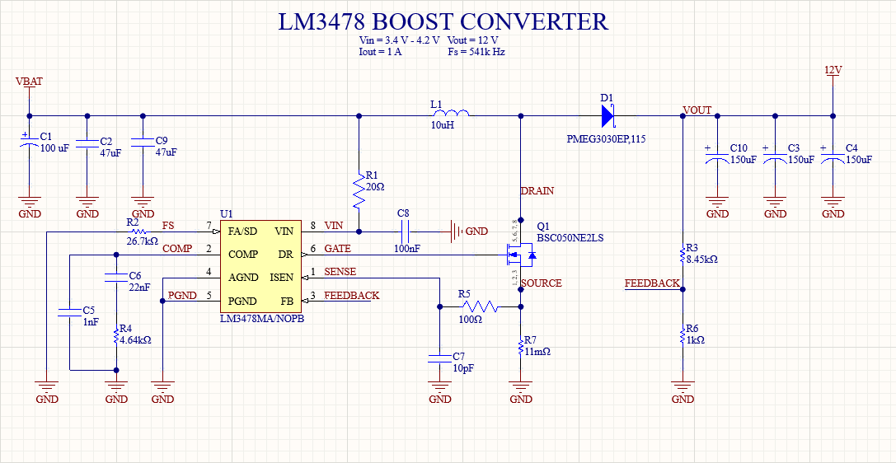

# LM3478 Boost Shield

A simple test PCB for LM3478 Boost Converter IC. Layouting is based on the Evaluation Board and datasheet guidelines.

## Design Constraints 
* **Vin:** 3.4V to 4.2V
* **Vout:** 12V
* **Iout:** 1A

## Schematic 

